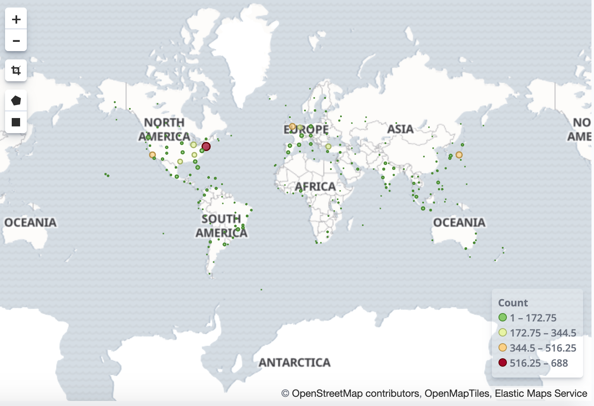
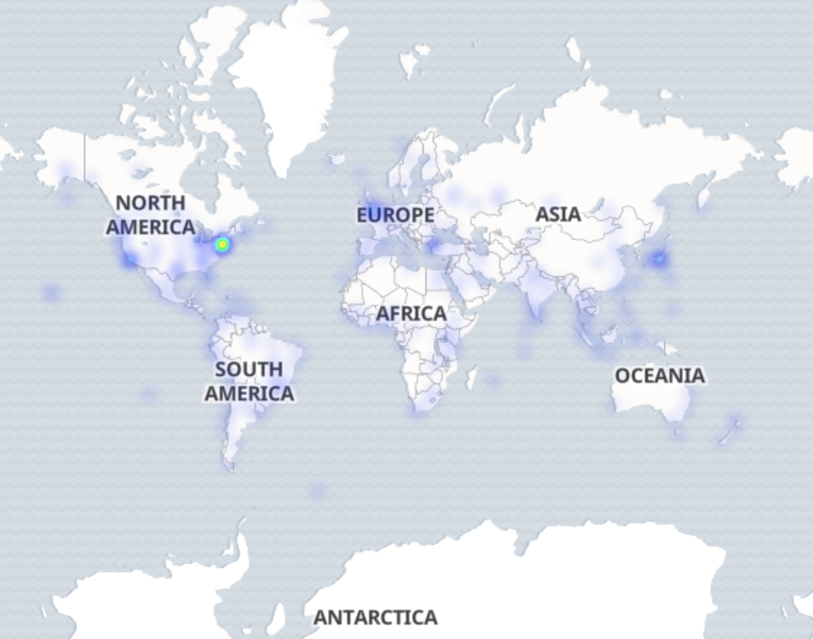

# Tweet Map with Trends

1. Build a `java` Tweet Collector to collect real-time tweets with Twitter Streaming API
2. Push collected tweets to `Kafka` cluster
3. Utilize `Apache Flink` Streaming to process (parse, filter and tranform) tweets
4. Ingest processed tweets to `Elasticsearch` for data persistance and index
5. Develop `SpringBoot` `RESTful API server` to query tweets from Elasticsearch 
6. Visualize real time tweet trends with Frontend `Angular` web application
7. Show Geographical Tweet Heat Map with `Kibana`
8. Create `Docker` image and deploy `microservices` to `Kubernetes` cluster

## Build

./gradlew :tweet-collector:clean :tweet-collector:build :tweet-collector:dockerPush

java -jar tweet-collector/build/libs/tweet-collector-1.1-SNAPSHOT.jar

./gradlew :flink-processor:clean :flink-processor:build

